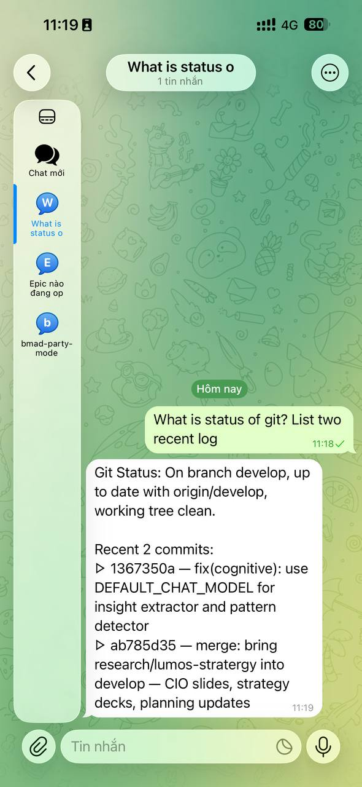

# Chati

```
   ██████╗██╗  ██╗ █████╗ ████████╗██╗
  ██╔════╝██║  ██║██╔══██╗╚══██╔══╝██║
  ██║     ███████║███████║   ██║   ██║
  ██║     ██╔══██║██╔══██║   ██║   ██║
  ╚██████╗██║  ██║██║  ██║   ██║   ██║
   ╚═════╝╚═╝  ╚═╝╚═╝  ╚═╝   ╚═╝  ╚═╝
        code from your pocket 💬→💻
```

[](LICENSE)

Chat with any AI coding CLI from your phone. No laptop needed.

<p align="center">
  
</p>

<p align="center">
  <video src="https://github.com/quangtam/chati/raw/main/assets/demo.mp4" width="360" controls>
    Video demo
  </video>
</p>

Chati bridges your favorite messaging app to AI coding CLIs (Kiro, Claude Code, Gemini, Codex) — send a message, get code back. Voice in, voice out.

## Features

### Core

- **Multi-CLI** — pluggable drivers for Kiro, Claude Code, Gemini, OpenAI Codex
- **Streaming** — real-time response streaming with progressive message edits (ChatGPT-like)
- **Thread = Session** — each chat thread maps to a separate CLI conversation
- **Model selection** — `/model` command with inline keyboard to switch AI models
- **BMAD workflow** — slash command routing for BMAD skills

### v2.0 — Persistence & Multi-Project

- **SQLite persistence** — thread configs, project bindings, and preferences survive bot restarts
- **Multi-project** — bind different threads to different project directories (`/project`, `/projects`)
- **Per-thread provider** — switch CLI provider per thread (`/provider claude`)
- **3-layer config resolution** — per-thread SQLite → global `.env` → hardcoded defaults

### v2.0 — Session Management

- **Concurrent session pool** — multiple threads run in parallel (configurable max)
- **Adaptive timeout** — per-thread timeout configuration
- **Idle cleanup** — stale sessions auto-killed after configurable idle period
- **Session visibility** — `/info` shows full session details, `/sessions` lists all active

### v2.0 — Interactive Decision Forwarding

- **Decision detection** — detects when CLI is waiting for user input (Y/n prompts, file selections)
- **Forwarding** — decision prompts forwarded to Telegram with context
- **Reply piping** — your reply is piped back to the CLI process
- **Timeout** — auto-kills sessions if decision reply not received within configurable window

### v2.0 — Screenshot Forwarding

- **Auto-detect** — detects image file paths in CLI output (`.png`, `.jpg`, `.gif`, `.webp`)
- **Auto-send** — screenshots sent as Telegram photos (or documents if >10MB)

### v2.0 — Voice Communication

- **Voice input** — send voice messages, transcribed via Whisper (OpenAI cloud or faster-whisper local)
- **Voice output** — responses read aloud via TTS (OpenAI TTS or edge-tts free)
- **Auto-backend** — if `OPENAI_API_KEY` is set, uses OpenAI; otherwise uses free local backends
- **Code-heavy detection** — skips TTS for code-heavy responses (>50% code blocks)
- **Per-thread config** — `/voice` toggle, `/voice speed 1.5`, `/voice status`
- **Confirm-first UX** — voice transcriptions shown for confirmation before sending (or auto-send mode)

## Supported CLIs

| Provider | Binary | Headless flag | Authentication | Setup guide |
| -------- | ------ | ------------- | -------------- | ----------- |
| Kiro | `kiro-cli` | `--no-interactive` | `kiro-cli login` on machine | [Setup Kiro](docs/setup-kiro.md) |
| Claude Code | `claude` | `-p` | `claude login` on machine | [Setup Claude](docs/setup-claude.md) |
| Gemini | `gemini` | `-p` | `gemini auth` on machine | [Setup Gemini](docs/setup-gemini.md) |
| Codex | `codex` | `exec` | `codex login` on machine | [Setup Codex](docs/setup-codex.md) |

> **Note:** All CLIs authenticate via browser login on the machine where Chati runs. Install the CLI, login once, and Chati uses that local session. No API keys needed for the CLI itself.

## Prerequisites

- **Python 3.12+** — [download](https://www.python.org/downloads/)
  - macOS: `brew install python@3.12`
  - Ubuntu: `sudo apt install python3.12`
  - Windows: download installer, check **"Add Python to PATH"**
- **One AI CLI installed and logged in** — see [Supported CLIs](#supported-clis)
- **Telegram account** — to create a bot via [@BotFather](https://t.me/BotFather)

## Quick Start

```bash
git clone https://github.com/quangtam/chati.git
cd chati
```

**macOS / Linux:**

```bash
bash setup.sh
./chati start
```

**Windows:**

```cmd
setup.bat
chati start
```

The setup wizard will:

1. Check Python version
2. Create virtual environment and install dependencies
3. Ask which AI CLI you want to use
4. Configure Telegram bot token and user ID
5. Set your project directory
6. Generate `.env`

After setup, login your CLI once and start:

```bash
# Login your CLI (one time only)
kiro-cli login    # or: claude login / gemini auth / codex login

# Start Chati
./chati start     # Windows: chati start
```

## Manual Setup

If you prefer to configure manually:

### 1. Create a chat bot

Currently supports Telegram. Create a bot via [@BotFather](https://t.me/BotFather):

1. Open Telegram, find `@BotFather`
2. Send `/newbot`, set name and username
3. Copy the **BOT_TOKEN**

### 2. Get your Telegram User ID

1. Find `@userinfobot` on Telegram
2. Send `/start` — it returns your User ID

### 3. Configure

```bash
cp .env.example .env
```

Edit `.env`:

```env
TELEGRAM_BOT_TOKEN=your-bot-token
ALLOWED_USER_IDS=123456789

# Pick your CLI provider: kiro, claude, gemini, codex
CLI_PROVIDER=kiro

PROJECT_DIR=/path/to/your/project
```

> **Auth:** Just login your CLI once on the machine (`kiro-cli login`, `claude login`, etc.). Chati uses that local session. No API keys needed in `.env`.

### 4. Install dependencies

```bash
python3 -m venv .venv
source .venv/bin/activate
pip install -r requirements.txt
```

### 5. Run

```bash
./chati start      # start in background     (Windows: chati start)
./chati stop       # stop                    (Windows: chati stop)
./chati restart    # restart                 (Windows: chati restart)
./chati status     # check if running        (Windows: chati status)
./chati log        # tail -f logs            (Windows: chati log)
```

## Usage

### Commands

| Command | Description |
| ------- | ----------- |
| `/start` | Show welcome message |
| `/help` | Full command reference |
| `/new` | Start fresh session (kills current) |
| `/cancel` | Kill running CLI process |
| `/resume` | Resume previous session |
| `/info` | Current session details (project, model, status, voice) |
| `/sessions` | List all active sessions across threads |
| `/model` | Select AI model (inline keyboard) |
| `/project <path>` | Bind thread to a project directory |
| `/projects` | Browse and switch between previous projects |
| `/provider <name>` | Switch CLI provider for this thread |
| `/voice` | Toggle voice output on/off |
| `/voice status` | Show voice configuration for this thread |
| `/voice speed 1.5` | Set TTS playback speed (0.25–4.0) |
| `/git` | Git info — branch, log, status, diff |
| `/git log` | Last 15 commits (graph) |
| `/git status` | Working tree status |
| `/git diff` | Unstaged changes (stat) |
| `/status` | CLI health check |
| `/skills` | List available BMAD workflows |

### Chat

Send any message — Chati forwards it to the configured CLI:

```text
You: Check sprint status
Chati: [streaming response from CLI]
```

### Thread-based sessions

- First message in a thread → new session
- Subsequent messages → auto-resume conversation
- `/new` in a thread → reset that thread's session
- Different threads can use different projects, providers, and models

### Decision forwarding

When the CLI asks a question (Y/n, file selection, etc.), Chati forwards it to you:

```text
Chati: ⚠️ CLI is waiting for input
       > Apply changes to 3 files? [Y/n]
       Reply to proceed, or /cancel to abort.

You: Y

Chati: [continues streaming CLI output]
```

### Voice

Send a voice message → Chati transcribes it and shows a confirmation keyboard:

```text
🎤 Transcription: "check the test results"
[✅ Send] [✏️ Edit] [🗑️ Cancel]
```

Responses are read aloud (when voice output is enabled and response isn't code-heavy).

### BMAD skills

```text
/bmad-sprint-status
/bmad-create-prd
/bmad-code-review
```

## Voice Configuration

Voice works out of the box with **zero configuration** using free local backends:

| Feature | With `OPENAI_API_KEY` | Without (free) |
| ------- | -------------------- | -------------- |
| Transcription | OpenAI Whisper (cloud) | faster-whisper (local CPU) |
| TTS | OpenAI TTS (cloud) | edge-tts (Microsoft Edge, free) |
| Quality | Higher | Good |
| Cost | Per-token | Free |
| Latency | ~1-2s | ~1-3s |

Optional `.env` settings:

```env
# Voice (all optional — works without any of these)
OPENAI_API_KEY=sk-...              # Enables cloud backends (higher quality)
VOICE_OUTPUT_ENABLED=true          # Global default for voice output
VOICE_AUTO_SEND=false              # Skip confirm keyboard for voice input
TTS_SPEED=1.5                      # Default TTS speed (0.25–4.0)
TTS_VOICE=coral                    # OpenAI voice: alloy, ash, coral, echo, fable, nova, onyx, sage, shimmer
TTS_LOCAL_VOICE=vi-VN-HoaiMyNeural # edge-tts voice (when no API key)
WHISPER_LOCAL_MODEL=base           # faster-whisper model: tiny, base, small
```

## Adding a new CLI provider

Create a file in `cli_providers/`, e.g. `cli_providers/my_cli.py`:

```python
from cli_providers.base import CliProvider

class MyCLIProvider(CliProvider):
    provider_id = "mycli"
    name = "My CLI"
    default_cli_path = "mycli"

    def build_args(self, prompt, *, model=None, resume=False):
        args = [self.config.cli_path, "--prompt", prompt]
        if model:
            args.extend(["--model", model])
        return args

    def build_env(self, base_env):
        env = self._base_env(base_env)
        if self.config.api_key:
            env["MYCLI_KEY"] = self.config.api_key
        return env
```

Then set `CLI_PROVIDER=mycli` in `.env`. No other changes needed — auto-discovered on startup.

## Architecture

```text
Telegram User
  → python-telegram-bot (async handlers)
    → SessionManager (per-thread PTY pool)
      → CliProvider.build_args() → PTY subprocess (streaming)
        → strip ANSI → extract response → MD→HTML → Telegram reply
        → detect screenshots → send photos
        → detect decisions → forward to user → pipe reply back
        → is_code_heavy? → TTS synthesis → send voice message
```

Key modules:

| File | Responsibility |
| ---- | -------------- |
| `chati.py` | Telegram handlers, command routing, streaming orchestration |
| `session_manager.py` | PTY session pool, state machine, idle cleanup |
| `cli_runner.py` | Subprocess wrapper, streaming, model listing |
| `db.py` | SQLite persistence, schema migration, config resolution |
| `config.py` | Environment configuration (frozen dataclass) |
| `message_utils.py` | ANSI strip, MD→HTML, message splitting, code detection |
| `voice.py` | Whisper transcription + TTS synthesis (dual-backend) |
| `cli_providers/` | Pluggable CLI drivers (auto-discovered) |

## Limitations

- Telegram message limit: 4096 chars (auto-split for longer output)
- Single bot instance per Telegram token (409 Conflict otherwise)
- Voice speed control only works with OpenAI TTS backend (edge-tts uses fixed rate mapping)

## License

[MIT](LICENSE) — free to use, modify, and distribute.
